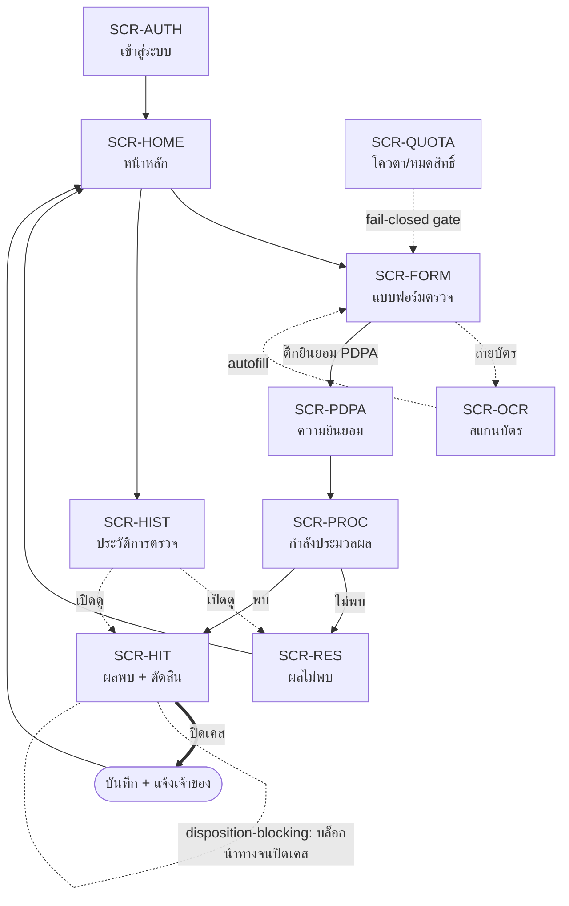

# ROONA — Full-System Flow Overview
> เอกสารอ้างอิงภาพรวม flow ทั้งระบบ (Screening LIFF) ประกอบจากทุกหน้าจอ + ทุก state ใน Storybook.
> สร้างอัตโนมัติจาก `packages/ui/storybook-static/index.json` — อย่าแก้ด้วยมือ (ดู §การอัปเดต).
- **หน้าจอ:** 11 หน้า · **states:** 103 · **+ catalog:** 165 → **รวม 268 stories** (ทั้ง Storybook)
- **Owner:** UX/UI + FE · **Phase:** 4-implementation · **Source:** `design/EXPERIENCE.md §8`

**ไฟล์ในชุดนี้:**
- [`prototype.html`](./prototype.html) — 🎬 **prototype คลิกได้** (กรอบมือถือ LIFF, เดินทีละ flow)
- [`gallery.html`](./gallery.html) — 🖼️ gallery ดูทุกหน้า/ทุก state พร้อมพรีวิว
- `README.md` (ไฟล์นี้) — flow map + ตาราง state (อ่านได้บน GitLab ทันที)

## 1. Flow map ทั้งระบบ
ที่มา: `design/EXPERIENCE.md §8 Key Flows` (UJ-1/2/3). ลูกศร = เส้นทางหลัก; QUOTA เป็น fail-closed gate.

**กฎ flow สำคัญ** (EXPERIENCE.md): ไม่มี bottom tab bar · หลังผล "พบ" บล็อกการนำทางจนกว่าจะปิดเคส · โควตา fail-closed, timeout ระหว่างประมวลผลไม่หักโควตา · session timeout ต่าง role กัน.

## 2. Interactive prototype — flows ที่เดินได้
เปิด [`prototype.html`](./prototype.html) เพื่อคลิกเดินแต่ละ flow ในกรอบมือถือ:
- **✅ Flow 1 — คัดกรอง 'ไม่พบ'** (14 จุด)
- **⚖️ Flow 2 — 'พบ' + ตัดสิน** (6 จุด)
- **🚫 Quota — fail-closed** (11 จุด)
- **🗂️ History / reopen** (8 จุด)
- **⏳ B. Processing degraded** (6 จุด)
- **🔒 C. Auth blocked (11 states)** (14 จุด)
- **📷 D. OCR ล้มเหลว → กรอกเอง** (13 จุด)
- **📝 E. Form — ประเภท + validation** (11 จุด)
- **📄 F. Evidence pack** (6 จุด)
- **🏠 G. Home — role/offline** (11 จุด)
- **🎯 H. HIT — รูปแบบผลพบ** (8 จุด)
- **📋 I. History — list/filter states** (14 จุด)
- **👥 Role: พนักงาน vs เจ้าของ** (8 จุด)

## 3. หน้าจอ + ทุก state
แต่ละ state ลิงก์เข้า Storybook (ต้อง build ก่อน — ดู §การเปิดใช้). `SCR-PWD` = N/A (placeholder).

### SCR-AUTH — เข้าสู่ระบบ  ·  13 states
เข้าสู่ระบบผ่าน LINE + สถานะบัญชี/สิทธิ์ (pre-login — ได้ hybrid visual ตาม ADR-0012)

| # | State | Storybook |
|---|-------|-----------|
| 1 | Login | [`screens-เข้าสู่ระบบ--login`](../../../packages/ui/storybook-static/index.html?path=/story/screens-%E0%B9%80%E0%B8%82%E0%B9%89%E0%B8%B2%E0%B8%AA%E0%B8%B9%E0%B9%88%E0%B8%A3%E0%B8%B0%E0%B8%9A%E0%B8%9A--login) |
| 2 | Loading | [`screens-เข้าสู่ระบบ--loading`](../../../packages/ui/storybook-static/index.html?path=/story/screens-%E0%B9%80%E0%B8%82%E0%B9%89%E0%B8%B2%E0%B8%AA%E0%B8%B9%E0%B9%88%E0%B8%A3%E0%B8%B0%E0%B8%9A%E0%B8%9A--loading) |
| 3 | Unbound Operator | [`screens-เข้าสู่ระบบ--unbound-operator`](../../../packages/ui/storybook-static/index.html?path=/story/screens-%E0%B9%80%E0%B8%82%E0%B9%89%E0%B8%B2%E0%B8%AA%E0%B8%B9%E0%B9%88%E0%B8%A3%E0%B8%B0%E0%B8%9A%E0%B8%9A--unbound-operator) |
| 4 | Unbound Owner | [`screens-เข้าสู่ระบบ--unbound-owner`](../../../packages/ui/storybook-static/index.html?path=/story/screens-%E0%B9%80%E0%B8%82%E0%B9%89%E0%B8%B2%E0%B8%AA%E0%B8%B9%E0%B9%88%E0%B8%A3%E0%B8%B0%E0%B8%9A%E0%B8%9A--unbound-owner) |
| 5 | Revoked | [`screens-เข้าสู่ระบบ--revoked`](../../../packages/ui/storybook-static/index.html?path=/story/screens-%E0%B9%80%E0%B8%82%E0%B9%89%E0%B8%B2%E0%B8%AA%E0%B8%B9%E0%B9%88%E0%B8%A3%E0%B8%B0%E0%B8%9A%E0%B8%9A--revoked) |
| 6 | Suspended | [`screens-เข้าสู่ระบบ--suspended`](../../../packages/ui/storybook-static/index.html?path=/story/screens-%E0%B9%80%E0%B8%82%E0%B9%89%E0%B8%B2%E0%B8%AA%E0%B8%B9%E0%B9%88%E0%B8%A3%E0%B8%B0%E0%B8%9A%E0%B8%9A--suspended) |
| 7 | Shop Dunning | [`screens-เข้าสู่ระบบ--shop-dunning`](../../../packages/ui/storybook-static/index.html?path=/story/screens-%E0%B9%80%E0%B8%82%E0%B9%89%E0%B8%B2%E0%B8%AA%E0%B8%B9%E0%B9%88%E0%B8%A3%E0%B8%B0%E0%B8%9A%E0%B8%9A--shop-dunning) |
| 8 | Shop Admin Hard | [`screens-เข้าสู่ระบบ--shop-admin-hard`](../../../packages/ui/storybook-static/index.html?path=/story/screens-%E0%B9%80%E0%B8%82%E0%B9%89%E0%B8%B2%E0%B8%AA%E0%B8%B9%E0%B9%88%E0%B8%A3%E0%B8%B0%E0%B8%9A%E0%B8%9A--shop-admin-hard) |
| 9 | Concurrency Full | [`screens-เข้าสู่ระบบ--concurrency-full`](../../../packages/ui/storybook-static/index.html?path=/story/screens-%E0%B9%80%E0%B8%82%E0%B9%89%E0%B8%B2%E0%B8%AA%E0%B8%B9%E0%B9%88%E0%B8%A3%E0%B8%B0%E0%B8%9A%E0%B8%9A--concurrency-full) |
| 10 | Line Outage | [`screens-เข้าสู่ระบบ--line-outage`](../../../packages/ui/storybook-static/index.html?path=/story/screens-%E0%B9%80%E0%B8%82%E0%B9%89%E0%B8%B2%E0%B8%AA%E0%B8%B9%E0%B9%88%E0%B8%A3%E0%B8%B0%E0%B8%9A%E0%B8%9A--line-outage) |
| 11 | Outside Line | [`screens-เข้าสู่ระบบ--outside-line`](../../../packages/ui/storybook-static/index.html?path=/story/screens-%E0%B9%80%E0%B8%82%E0%B9%89%E0%B8%B2%E0%B8%AA%E0%B8%B9%E0%B9%88%E0%B8%A3%E0%B8%B0%E0%B8%9A%E0%B8%9A--outside-line) |
| 12 | Oauth Error | [`screens-เข้าสู่ระบบ--oauth-error`](../../../packages/ui/storybook-static/index.html?path=/story/screens-%E0%B9%80%E0%B8%82%E0%B9%89%E0%B8%B2%E0%B8%AA%E0%B8%B9%E0%B9%88%E0%B8%A3%E0%B8%B0%E0%B8%9A%E0%B8%9A--oauth-error) |
| 13 | Single Device Kick | [`screens-เข้าสู่ระบบ--single-device-kick`](../../../packages/ui/storybook-static/index.html?path=/story/screens-%E0%B9%80%E0%B8%82%E0%B9%89%E0%B8%B2%E0%B8%AA%E0%B8%B9%E0%B9%88%E0%B8%A3%E0%B8%B0%E0%B8%9A%E0%B8%9A--single-device-kick) |

### SCR-HOME — หน้าหลัก  ·  12 states
แดชบอร์ดหลังล็อกอิน: เริ่มตรวจ, โควตา, รายการล่าสุด

| # | State | Storybook |
|---|-------|-----------|
| 1 | Default | [`screens-หน้าหลัก--default`](../../../packages/ui/storybook-static/index.html?path=/story/screens-%E0%B8%AB%E0%B8%99%E0%B9%89%E0%B8%B2%E0%B8%AB%E0%B8%A5%E0%B8%B1%E0%B8%81--default) |
| 2 | Empty | [`screens-หน้าหลัก--empty`](../../../packages/ui/storybook-static/index.html?path=/story/screens-%E0%B8%AB%E0%B8%99%E0%B9%89%E0%B8%B2%E0%B8%AB%E0%B8%A5%E0%B8%B1%E0%B8%81--empty) |
| 3 | Quota Low | [`screens-หน้าหลัก--quota-low`](../../../packages/ui/storybook-static/index.html?path=/story/screens-%E0%B8%AB%E0%B8%99%E0%B9%89%E0%B8%B2%E0%B8%AB%E0%B8%A5%E0%B8%B1%E0%B8%81--quota-low) |
| 4 | Quota Empty | [`screens-หน้าหลัก--quota-empty`](../../../packages/ui/storybook-static/index.html?path=/story/screens-%E0%B8%AB%E0%B8%99%E0%B9%89%E0%B8%B2%E0%B8%AB%E0%B8%A5%E0%B8%B1%E0%B8%81--quota-empty) |
| 5 | Owner Role | [`screens-หน้าหลัก--owner-role`](../../../packages/ui/storybook-static/index.html?path=/story/screens-%E0%B8%AB%E0%B8%99%E0%B9%89%E0%B8%B2%E0%B8%AB%E0%B8%A5%E0%B8%B1%E0%B8%81--owner-role) |
| 6 | Many Records | [`screens-หน้าหลัก--many-records`](../../../packages/ui/storybook-static/index.html?path=/story/screens-%E0%B8%AB%E0%B8%99%E0%B9%89%E0%B8%B2%E0%B8%AB%E0%B8%A5%E0%B8%B1%E0%B8%81--many-records) |
| 7 | Long Names | [`screens-หน้าหลัก--long-names`](../../../packages/ui/storybook-static/index.html?path=/story/screens-%E0%B8%AB%E0%B8%99%E0%B9%89%E0%B8%B2%E0%B8%AB%E0%B8%A5%E0%B8%B1%E0%B8%81--long-names) |
| 8 | Loading | [`screens-หน้าหลัก--loading`](../../../packages/ui/storybook-static/index.html?path=/story/screens-%E0%B8%AB%E0%B8%99%E0%B9%89%E0%B8%B2%E0%B8%AB%E0%B8%A5%E0%B8%B1%E0%B8%81--loading) |
| 9 | Identity Error | [`screens-หน้าหลัก--identity-error`](../../../packages/ui/storybook-static/index.html?path=/story/screens-%E0%B8%AB%E0%B8%99%E0%B9%89%E0%B8%B2%E0%B8%AB%E0%B8%A5%E0%B8%B1%E0%B8%81--identity-error) |
| 10 | Offline | [`screens-หน้าหลัก--offline`](../../../packages/ui/storybook-static/index.html?path=/story/screens-%E0%B8%AB%E0%B8%99%E0%B9%89%E0%B8%B2%E0%B8%AB%E0%B8%A5%E0%B8%B1%E0%B8%81--offline) |
| 11 | Uat Badge | [`screens-หน้าหลัก--uat-badge`](../../../packages/ui/storybook-static/index.html?path=/story/screens-%E0%B8%AB%E0%B8%99%E0%B9%89%E0%B8%B2%E0%B8%AB%E0%B8%A5%E0%B8%B1%E0%B8%81--uat-badge) |
| 12 | Sub Screen Header | [`screens-หน้าหลัก--sub-screen-header`](../../../packages/ui/storybook-static/index.html?path=/story/screens-%E0%B8%AB%E0%B8%99%E0%B9%89%E0%B8%B2%E0%B8%AB%E0%B8%A5%E0%B8%B1%E0%B8%81--sub-screen-header) |

### SCR-FORM — แบบฟอร์มตรวจ  ·  12 states
กรอกข้อมูลผู้ถูกตรวจ + ติ๊กยินยอม PDPA ก่อนกดตรวจ

| # | State | Storybook |
|---|-------|-----------|
| 1 | Empty | [`screens-แบบฟอร์มตรวจ--empty`](../../../packages/ui/storybook-static/index.html?path=/story/screens-%E0%B9%81%E0%B8%9A%E0%B8%9A%E0%B8%9F%E0%B8%AD%E0%B8%A3%E0%B9%8C%E0%B8%A1%E0%B8%95%E0%B8%A3%E0%B8%A7%E0%B8%88--empty) |
| 2 | Partially Filled | [`screens-แบบฟอร์มตรวจ--partially-filled`](../../../packages/ui/storybook-static/index.html?path=/story/screens-%E0%B9%81%E0%B8%9A%E0%B8%9A%E0%B8%9F%E0%B8%AD%E0%B8%A3%E0%B9%8C%E0%B8%A1%E0%B8%95%E0%B8%A3%E0%B8%A7%E0%B8%88--partially-filled) |
| 3 | Thai | [`screens-แบบฟอร์มตรวจ--thai`](../../../packages/ui/storybook-static/index.html?path=/story/screens-%E0%B9%81%E0%B8%9A%E0%B8%9A%E0%B8%9F%E0%B8%AD%E0%B8%A3%E0%B9%8C%E0%B8%A1%E0%B8%95%E0%B8%A3%E0%B8%A7%E0%B8%88--thai) |
| 4 | Foreigner | [`screens-แบบฟอร์มตรวจ--foreigner`](../../../packages/ui/storybook-static/index.html?path=/story/screens-%E0%B9%81%E0%B8%9A%E0%B8%9A%E0%B8%9F%E0%B8%AD%E0%B8%A3%E0%B9%8C%E0%B8%A1%E0%B8%95%E0%B8%A3%E0%B8%A7%E0%B8%88--foreigner) |
| 5 | Entity | [`screens-แบบฟอร์มตรวจ--entity`](../../../packages/ui/storybook-static/index.html?path=/story/screens-%E0%B9%81%E0%B8%9A%E0%B8%9A%E0%B8%9F%E0%B8%AD%E0%B8%A3%E0%B9%8C%E0%B8%A1%E0%B8%95%E0%B8%A3%E0%B8%A7%E0%B8%88--entity) |
| 6 | Ready To Submit | [`screens-แบบฟอร์มตรวจ--ready-to-submit`](../../../packages/ui/storybook-static/index.html?path=/story/screens-%E0%B9%81%E0%B8%9A%E0%B8%9A%E0%B8%9F%E0%B8%AD%E0%B8%A3%E0%B9%8C%E0%B8%A1%E0%B8%95%E0%B8%A3%E0%B8%A7%E0%B8%88--ready-to-submit) |
| 7 | Ocr Autofilled | [`screens-แบบฟอร์มตรวจ--ocr-autofilled`](../../../packages/ui/storybook-static/index.html?path=/story/screens-%E0%B9%81%E0%B8%9A%E0%B8%9A%E0%B8%9F%E0%B8%AD%E0%B8%A3%E0%B9%8C%E0%B8%A1%E0%B8%95%E0%B8%A3%E0%B8%A7%E0%B8%88--ocr-autofilled) |
| 8 | Validation Error | [`screens-แบบฟอร์มตรวจ--validation-error`](../../../packages/ui/storybook-static/index.html?path=/story/screens-%E0%B9%81%E0%B8%9A%E0%B8%9A%E0%B8%9F%E0%B8%AD%E0%B8%A3%E0%B9%8C%E0%B8%A1%E0%B8%95%E0%B8%A3%E0%B8%A7%E0%B8%88--validation-error) |
| 9 | Checksum Warning | [`screens-แบบฟอร์มตรวจ--checksum-warning`](../../../packages/ui/storybook-static/index.html?path=/story/screens-%E0%B9%81%E0%B8%9A%E0%B8%9A%E0%B8%9F%E0%B8%AD%E0%B8%A3%E0%B9%8C%E0%B8%A1%E0%B8%95%E0%B8%A3%E0%B8%A7%E0%B8%88--checksum-warning) |
| 10 | Quota Low | [`screens-แบบฟอร์มตรวจ--quota-low`](../../../packages/ui/storybook-static/index.html?path=/story/screens-%E0%B9%81%E0%B8%9A%E0%B8%9A%E0%B8%9F%E0%B8%AD%E0%B8%A3%E0%B9%8C%E0%B8%A1%E0%B8%95%E0%B8%A3%E0%B8%A7%E0%B8%88--quota-low) |
| 11 | Quota Exhausted | [`screens-แบบฟอร์มตรวจ--quota-exhausted`](../../../packages/ui/storybook-static/index.html?path=/story/screens-%E0%B9%81%E0%B8%9A%E0%B8%9A%E0%B8%9F%E0%B8%AD%E0%B8%A3%E0%B9%8C%E0%B8%A1%E0%B8%95%E0%B8%A3%E0%B8%A7%E0%B8%88--quota-exhausted) |
| 12 | Type Change Confirm | [`screens-แบบฟอร์มตรวจ--type-change-confirm`](../../../packages/ui/storybook-static/index.html?path=/story/screens-%E0%B9%81%E0%B8%9A%E0%B8%9A%E0%B8%9F%E0%B8%AD%E0%B8%A3%E0%B9%8C%E0%B8%A1%E0%B8%95%E0%B8%A3%E0%B8%A7%E0%B8%88--type-change-confirm) |

### SCR-OCR — สแกนบัตร  ·  12 states
ถ่าย/อัปโหลดบัตร → OCR autofill เข้าฟอร์ม

| # | State | Storybook |
|---|-------|-----------|
| 1 | Capture | [`screens-สแกนบัตร--capture`](../../../packages/ui/storybook-static/index.html?path=/story/screens-%E0%B8%AA%E0%B9%81%E0%B8%81%E0%B8%99%E0%B8%9A%E0%B8%B1%E0%B8%95%E0%B8%A3--capture) |
| 2 | Capture Passport | [`screens-สแกนบัตร--capture-passport`](../../../packages/ui/storybook-static/index.html?path=/story/screens-%E0%B8%AA%E0%B9%81%E0%B8%81%E0%B8%99%E0%B8%9A%E0%B8%B1%E0%B8%95%E0%B8%A3--capture-passport) |
| 3 | Upload Error | [`screens-สแกนบัตร--upload-error`](../../../packages/ui/storybook-static/index.html?path=/story/screens-%E0%B8%AA%E0%B9%81%E0%B8%81%E0%B8%99%E0%B8%9A%E0%B8%B1%E0%B8%95%E0%B8%A3--upload-error) |
| 4 | Preview | [`screens-สแกนบัตร--preview`](../../../packages/ui/storybook-static/index.html?path=/story/screens-%E0%B8%AA%E0%B9%81%E0%B8%81%E0%B8%99%E0%B8%9A%E0%B8%B1%E0%B8%95%E0%B8%A3--preview) |
| 5 | Preview Passport | [`screens-สแกนบัตร--preview-passport`](../../../packages/ui/storybook-static/index.html?path=/story/screens-%E0%B8%AA%E0%B9%81%E0%B8%81%E0%B8%99%E0%B8%9A%E0%B8%B1%E0%B8%95%E0%B8%A3--preview-passport) |
| 6 | Loading | [`screens-สแกนบัตร--loading`](../../../packages/ui/storybook-static/index.html?path=/story/screens-%E0%B8%AA%E0%B9%81%E0%B8%81%E0%B8%99%E0%B8%9A%E0%B8%B1%E0%B8%95%E0%B8%A3--loading) |
| 7 | Success | [`screens-สแกนบัตร--success`](../../../packages/ui/storybook-static/index.html?path=/story/screens-%E0%B8%AA%E0%B9%81%E0%B8%81%E0%B8%99%E0%B8%9A%E0%B8%B1%E0%B8%95%E0%B8%A3--success) |
| 8 | Success Passport | [`screens-สแกนบัตร--success-passport`](../../../packages/ui/storybook-static/index.html?path=/story/screens-%E0%B8%AA%E0%B9%81%E0%B8%81%E0%B8%99%E0%B8%9A%E0%B8%B1%E0%B8%95%E0%B8%A3--success-passport) |
| 9 | Low Confidence | [`screens-สแกนบัตร--low-confidence`](../../../packages/ui/storybook-static/index.html?path=/story/screens-%E0%B8%AA%E0%B9%81%E0%B8%81%E0%B8%99%E0%B8%9A%E0%B8%B1%E0%B8%95%E0%B8%A3--low-confidence) |
| 10 | Ocr Failed | [`screens-สแกนบัตร--ocr-failed`](../../../packages/ui/storybook-static/index.html?path=/story/screens-%E0%B8%AA%E0%B9%81%E0%B8%81%E0%B8%99%E0%B8%9A%E0%B8%B1%E0%B8%95%E0%B8%A3--ocr-failed) |
| 11 | Camera Denied | [`screens-สแกนบัตร--camera-denied`](../../../packages/ui/storybook-static/index.html?path=/story/screens-%E0%B8%AA%E0%B9%81%E0%B8%81%E0%B8%99%E0%B8%9A%E0%B8%B1%E0%B8%95%E0%B8%A3--camera-denied) |
| 12 | No Camera | [`screens-สแกนบัตร--no-camera`](../../../packages/ui/storybook-static/index.html?path=/story/screens-%E0%B8%AA%E0%B9%81%E0%B8%81%E0%B8%99%E0%B8%9A%E0%B8%B1%E0%B8%95%E0%B8%A3--no-camera) |

### SCR-PDPA — ความยินยอม PDPA  ·  4 states
หน้าแสดง/บันทึกความยินยอม PDPA

| # | State | Storybook |
|---|-------|-----------|
| 1 | Default | [`screens-ความยินยอม-pdpa--default`](../../../packages/ui/storybook-static/index.html?path=/story/screens-%E0%B8%84%E0%B8%A7%E0%B8%B2%E0%B8%A1%E0%B8%A2%E0%B8%B4%E0%B8%99%E0%B8%A2%E0%B8%AD%E0%B8%A1-pdpa--default) |
| 2 | Acknowledged | [`screens-ความยินยอม-pdpa--acknowledged`](../../../packages/ui/storybook-static/index.html?path=/story/screens-%E0%B8%84%E0%B8%A7%E0%B8%B2%E0%B8%A1%E0%B8%A2%E0%B8%B4%E0%B8%99%E0%B8%A2%E0%B8%AD%E0%B8%A1-pdpa--acknowledged) |
| 3 | Notice Error | [`screens-ความยินยอม-pdpa--notice-error`](../../../packages/ui/storybook-static/index.html?path=/story/screens-%E0%B8%84%E0%B8%A7%E0%B8%B2%E0%B8%A1%E0%B8%A2%E0%B8%B4%E0%B8%99%E0%B8%A2%E0%B8%AD%E0%B8%A1-pdpa--notice-error) |
| 4 | Loading | [`screens-ความยินยอม-pdpa--loading`](../../../packages/ui/storybook-static/index.html?path=/story/screens-%E0%B8%84%E0%B8%A7%E0%B8%B2%E0%B8%A1%E0%B8%A2%E0%B8%B4%E0%B8%99%E0%B8%A2%E0%B8%AD%E0%B8%A1-pdpa--loading) |

### SCR-PROC — กำลังประมวลผล  ·  5 states
สถานะกำลังคัดกรอง (2 เฟส: skeleton → reassurance; timeout ไม่หักโควตา)

| # | State | Storybook |
|---|-------|-----------|
| 1 | Loading | [`screens-กำลังประมวลผล--loading`](../../../packages/ui/storybook-static/index.html?path=/story/screens-%E0%B8%81%E0%B8%B3%E0%B8%A5%E0%B8%B1%E0%B8%87%E0%B8%9B%E0%B8%A3%E0%B8%B0%E0%B8%A1%E0%B8%A7%E0%B8%A5%E0%B8%9C%E0%B8%A5--loading) |
| 2 | Slow | [`screens-กำลังประมวลผล--slow`](../../../packages/ui/storybook-static/index.html?path=/story/screens-%E0%B8%81%E0%B8%B3%E0%B8%A5%E0%B8%B1%E0%B8%87%E0%B8%9B%E0%B8%A3%E0%B8%B0%E0%B8%A1%E0%B8%A7%E0%B8%A5%E0%B8%9C%E0%B8%A5--slow) |
| 3 | Timeout | [`screens-กำลังประมวลผล--timeout`](../../../packages/ui/storybook-static/index.html?path=/story/screens-%E0%B8%81%E0%B8%B3%E0%B8%A5%E0%B8%B1%E0%B8%87%E0%B8%9B%E0%B8%A3%E0%B8%B0%E0%B8%A1%E0%B8%A7%E0%B8%A5%E0%B8%9C%E0%B8%A5--timeout) |
| 4 | Network | [`screens-กำลังประมวลผล--network`](../../../packages/ui/storybook-static/index.html?path=/story/screens-%E0%B8%81%E0%B8%B3%E0%B8%A5%E0%B8%B1%E0%B8%87%E0%B8%9B%E0%B8%A3%E0%B8%B0%E0%B8%A1%E0%B8%A7%E0%B8%A5%E0%B8%9C%E0%B8%A5--network) |
| 5 | Shell Offline | [`screens-กำลังประมวลผล--shell-offline`](../../../packages/ui/storybook-static/index.html?path=/story/screens-%E0%B8%81%E0%B8%B3%E0%B8%A5%E0%B8%B1%E0%B8%87%E0%B8%9B%E0%B8%A3%E0%B8%B0%E0%B8%A1%E0%B8%A7%E0%B8%A5%E0%B8%9C%E0%B8%A5--shell-offline) |

### SCR-RES — ผลไม่พบ  ·  5 states
ผลลัพธ์ไม่พบ (no-hit) + เอกสารหลักฐาน

| # | State | Storybook |
|---|-------|-----------|
| 1 | No Hit | [`screens-ผลไม่พบ--no-hit`](../../../packages/ui/storybook-static/index.html?path=/story/screens-%E0%B8%9C%E0%B8%A5%E0%B9%84%E0%B8%A1%E0%B9%88%E0%B8%9E%E0%B8%9A--no-hit) |
| 2 | Evidence Long Name | [`screens-ผลไม่พบ--evidence-long-name`](../../../packages/ui/storybook-static/index.html?path=/story/screens-%E0%B8%9C%E0%B8%A5%E0%B9%84%E0%B8%A1%E0%B9%88%E0%B8%9E%E0%B8%9A--evidence-long-name) |
| 3 | Evidence Loading | [`screens-ผลไม่พบ--evidence-loading`](../../../packages/ui/storybook-static/index.html?path=/story/screens-%E0%B8%9C%E0%B8%A5%E0%B9%84%E0%B8%A1%E0%B9%88%E0%B8%9E%E0%B8%9A--evidence-loading) |
| 4 | Evidence Redownload | [`screens-ผลไม่พบ--evidence-redownload`](../../../packages/ui/storybook-static/index.html?path=/story/screens-%E0%B8%9C%E0%B8%A5%E0%B9%84%E0%B8%A1%E0%B9%88%E0%B8%9E%E0%B8%9A--evidence-redownload) |
| 5 | Gen Fail | [`screens-ผลไม่พบ--gen-fail`](../../../packages/ui/storybook-static/index.html?path=/story/screens-%E0%B8%9C%E0%B8%A5%E0%B9%84%E0%B8%A1%E0%B9%88%E0%B8%9E%E0%B8%9A--gen-fail) |

### SCR-HIT — ผลพบ + ตัดสิน  ·  11 states
ผลพบ (hit) + โซนตัดสิน; บล็อกการนำทางจนกว่าจะปิดเคส

| # | State | Storybook |
|---|-------|-----------|
| 1 | Default | [`screens-ผลพบ-ตัดสิน--default`](../../../packages/ui/storybook-static/index.html?path=/story/screens-%E0%B8%9C%E0%B8%A5%E0%B8%9E%E0%B8%9A-%E0%B8%95%E0%B8%B1%E0%B8%94%E0%B8%AA%E0%B8%B4%E0%B8%99--default) |
| 2 | Multi Match | [`screens-ผลพบ-ตัดสิน--multi-match`](../../../packages/ui/storybook-static/index.html?path=/story/screens-%E0%B8%9C%E0%B8%A5%E0%B8%9E%E0%B8%9A-%E0%B8%95%E0%B8%B1%E0%B8%94%E0%B8%AA%E0%B8%B4%E0%B8%99--multi-match) |
| 3 | Overflow | [`screens-ผลพบ-ตัดสิน--overflow`](../../../packages/ui/storybook-static/index.html?path=/story/screens-%E0%B8%9C%E0%B8%A5%E0%B8%9E%E0%B8%9A-%E0%B8%95%E0%B8%B1%E0%B8%94%E0%B8%AA%E0%B8%B4%E0%B8%99--overflow) |
| 4 | Generic Cap | [`screens-ผลพบ-ตัดสิน--generic-cap`](../../../packages/ui/storybook-static/index.html?path=/story/screens-%E0%B8%9C%E0%B8%A5%E0%B8%9E%E0%B8%9A-%E0%B8%95%E0%B8%B1%E0%B8%94%E0%B8%AA%E0%B8%B4%E0%B8%99--generic-cap) |
| 5 | True Match | [`screens-ผลพบ-ตัดสิน--true-match`](../../../packages/ui/storybook-static/index.html?path=/story/screens-%E0%B8%9C%E0%B8%A5%E0%B8%9E%E0%B8%9A-%E0%B8%95%E0%B8%B1%E0%B8%94%E0%B8%AA%E0%B8%B4%E0%B8%99--true-match) |
| 6 | False Positive | [`screens-ผลพบ-ตัดสิน--false-positive`](../../../packages/ui/storybook-static/index.html?path=/story/screens-%E0%B8%9C%E0%B8%A5%E0%B8%9E%E0%B8%9A-%E0%B8%95%E0%B8%B1%E0%B8%94%E0%B8%AA%E0%B8%B4%E0%B8%99--false-positive) |
| 7 | Entity Dual | [`screens-ผลพบ-ตัดสิน--entity-dual`](../../../packages/ui/storybook-static/index.html?path=/story/screens-%E0%B8%9C%E0%B8%A5%E0%B8%9E%E0%B8%9A-%E0%B8%95%E0%B8%B1%E0%B8%94%E0%B8%AA%E0%B8%B4%E0%B8%99--entity-dual) |
| 8 | View Full | [`screens-ผลพบ-ตัดสิน--view-full`](../../../packages/ui/storybook-static/index.html?path=/story/screens-%E0%B8%9C%E0%B8%A5%E0%B8%9E%E0%B8%9A-%E0%B8%95%E0%B8%B1%E0%B8%94%E0%B8%AA%E0%B8%B4%E0%B8%99--view-full) |
| 9 | Closed Recorded | [`screens-ผลพบ-ตัดสิน--closed-recorded`](../../../packages/ui/storybook-static/index.html?path=/story/screens-%E0%B8%9C%E0%B8%A5%E0%B8%9E%E0%B8%9A-%E0%B8%95%E0%B8%B1%E0%B8%94%E0%B8%AA%E0%B8%B4%E0%B8%99--closed-recorded) |
| 10 | Long Candidate Name | [`screens-ผลพบ-ตัดสิน--long-candidate-name`](../../../packages/ui/storybook-static/index.html?path=/story/screens-%E0%B8%9C%E0%B8%A5%E0%B8%9E%E0%B8%9A-%E0%B8%95%E0%B8%B1%E0%B8%94%E0%B8%AA%E0%B8%B4%E0%B8%99--long-candidate-name) |
| 11 | Pending | [`screens-ผลพบ-ตัดสิน--pending`](../../../packages/ui/storybook-static/index.html?path=/story/screens-%E0%B8%9C%E0%B8%A5%E0%B8%9E%E0%B8%9A-%E0%B8%95%E0%B8%B1%E0%B8%94%E0%B8%AA%E0%B8%B4%E0%B8%99--pending) |

### SCR-HIST — ประวัติการตรวจ  ·  19 states
ประวัติการตรวจทั้งหมด: ค้นหา/กรอง/เปิดเคสซ้ำ/หลักฐาน

| # | State | Storybook |
|---|-------|-----------|
| 1 | Default | [`screens-ประวัติการตรวจ--default`](../../../packages/ui/storybook-static/index.html?path=/story/screens-%E0%B8%9B%E0%B8%A3%E0%B8%B0%E0%B8%A7%E0%B8%B1%E0%B8%95%E0%B8%B4%E0%B8%81%E0%B8%B2%E0%B8%A3%E0%B8%95%E0%B8%A3%E0%B8%A7%E0%B8%88--default) |
| 2 | Empty | [`screens-ประวัติการตรวจ--empty`](../../../packages/ui/storybook-static/index.html?path=/story/screens-%E0%B8%9B%E0%B8%A3%E0%B8%B0%E0%B8%A7%E0%B8%B1%E0%B8%95%E0%B8%B4%E0%B8%81%E0%B8%B2%E0%B8%A3%E0%B8%95%E0%B8%A3%E0%B8%A7%E0%B8%88--empty) |
| 3 | Large Dataset | [`screens-ประวัติการตรวจ--large-dataset`](../../../packages/ui/storybook-static/index.html?path=/story/screens-%E0%B8%9B%E0%B8%A3%E0%B8%B0%E0%B8%A7%E0%B8%B1%E0%B8%95%E0%B8%B4%E0%B8%81%E0%B8%B2%E0%B8%A3%E0%B8%95%E0%B8%A3%E0%B8%A7%E0%B8%88--large-dataset) |
| 4 | With Active Filters | [`screens-ประวัติการตรวจ--with-active-filters`](../../../packages/ui/storybook-static/index.html?path=/story/screens-%E0%B8%9B%E0%B8%A3%E0%B8%B0%E0%B8%A7%E0%B8%B1%E0%B8%95%E0%B8%B4%E0%B8%81%E0%B8%B2%E0%B8%A3%E0%B8%95%E0%B8%A3%E0%B8%A7%E0%B8%88--with-active-filters) |
| 5 | Loading | [`screens-ประวัติการตรวจ--loading`](../../../packages/ui/storybook-static/index.html?path=/story/screens-%E0%B8%9B%E0%B8%A3%E0%B8%B0%E0%B8%A7%E0%B8%B1%E0%B8%95%E0%B8%B4%E0%B8%81%E0%B8%B2%E0%B8%A3%E0%B8%95%E0%B8%A3%E0%B8%A7%E0%B8%88--loading) |
| 6 | Filtered Empty | [`screens-ประวัติการตรวจ--filtered-empty`](../../../packages/ui/storybook-static/index.html?path=/story/screens-%E0%B8%9B%E0%B8%A3%E0%B8%B0%E0%B8%A7%E0%B8%B1%E0%B8%95%E0%B8%B4%E0%B8%81%E0%B8%B2%E0%B8%A3%E0%B8%95%E0%B8%A3%E0%B8%A7%E0%B8%88--filtered-empty) |
| 7 | Error State | [`screens-ประวัติการตรวจ--error-state`](../../../packages/ui/storybook-static/index.html?path=/story/screens-%E0%B8%9B%E0%B8%A3%E0%B8%B0%E0%B8%A7%E0%B8%B1%E0%B8%95%E0%B8%B4%E0%B8%81%E0%B8%B2%E0%B8%A3%E0%B8%95%E0%B8%A3%E0%B8%A7%E0%B8%88--error-state) |
| 8 | Action Required | [`screens-ประวัติการตรวจ--action-required`](../../../packages/ui/storybook-static/index.html?path=/story/screens-%E0%B8%9B%E0%B8%A3%E0%B8%B0%E0%B8%A7%E0%B8%B1%E0%B8%95%E0%B8%B4%E0%B8%81%E0%B8%B2%E0%B8%A3%E0%B8%95%E0%B8%A3%E0%B8%A7%E0%B8%88--action-required) |
| 9 | Operator Role | [`screens-ประวัติการตรวจ--operator-role`](../../../packages/ui/storybook-static/index.html?path=/story/screens-%E0%B8%9B%E0%B8%A3%E0%B8%B0%E0%B8%A7%E0%B8%B1%E0%B8%95%E0%B8%B4%E0%B8%81%E0%B8%B2%E0%B8%A3%E0%B8%95%E0%B8%A3%E0%B8%A7%E0%B8%88--operator-role) |
| 10 | Sort By Name | [`screens-ประวัติการตรวจ--sort-by-name`](../../../packages/ui/storybook-static/index.html?path=/story/screens-%E0%B8%9B%E0%B8%A3%E0%B8%B0%E0%B8%A7%E0%B8%B1%E0%B8%95%E0%B8%B4%E0%B8%81%E0%B8%B2%E0%B8%A3%E0%B8%95%E0%B8%A3%E0%B8%A7%E0%B8%88--sort-by-name) |
| 11 | Risk Groups | [`screens-ประวัติการตรวจ--risk-groups`](../../../packages/ui/storybook-static/index.html?path=/story/screens-%E0%B8%9B%E0%B8%A3%E0%B8%B0%E0%B8%A7%E0%B8%B1%E0%B8%95%E0%B8%B4%E0%B8%81%E0%B8%B2%E0%B8%A3%E0%B8%95%E0%B8%A3%E0%B8%A7%E0%B8%88--risk-groups) |
| 12 | Offline | [`screens-ประวัติการตรวจ--offline`](../../../packages/ui/storybook-static/index.html?path=/story/screens-%E0%B8%9B%E0%B8%A3%E0%B8%B0%E0%B8%A7%E0%B8%B1%E0%B8%95%E0%B8%B4%E0%B8%81%E0%B8%B2%E0%B8%A3%E0%B8%95%E0%B8%A3%E0%B8%A7%E0%B8%88--offline) |
| 13 | Evidence Pack States | [`screens-ประวัติการตรวจ--evidence-pack-states`](../../../packages/ui/storybook-static/index.html?path=/story/screens-%E0%B8%9B%E0%B8%A3%E0%B8%B0%E0%B8%A7%E0%B8%B1%E0%B8%95%E0%B8%B4%E0%B8%81%E0%B8%B2%E0%B8%A3%E0%B8%95%E0%B8%A3%E0%B8%A7%E0%B8%88--evidence-pack-states) |
| 14 | Stale Conflict | [`screens-ประวัติการตรวจ--stale-conflict`](../../../packages/ui/storybook-static/index.html?path=/story/screens-%E0%B8%9B%E0%B8%A3%E0%B8%B0%E0%B8%A7%E0%B8%B1%E0%B8%95%E0%B8%B4%E0%B8%81%E0%B8%B2%E0%B8%A3%E0%B8%95%E0%B8%A3%E0%B8%A7%E0%B8%88--stale-conflict) |
| 15 | Reopen Blocked Quota | [`screens-ประวัติการตรวจ--reopen-blocked-quota`](../../../packages/ui/storybook-static/index.html?path=/story/screens-%E0%B8%9B%E0%B8%A3%E0%B8%B0%E0%B8%A7%E0%B8%B1%E0%B8%95%E0%B8%B4%E0%B8%81%E0%B8%B2%E0%B8%A3%E0%B8%95%E0%B8%A3%E0%B8%A7%E0%B8%88--reopen-blocked-quota) |
| 16 | Reopen Blocked Trial | [`screens-ประวัติการตรวจ--reopen-blocked-trial`](../../../packages/ui/storybook-static/index.html?path=/story/screens-%E0%B8%9B%E0%B8%A3%E0%B8%B0%E0%B8%A7%E0%B8%B1%E0%B8%95%E0%B8%B4%E0%B8%81%E0%B8%B2%E0%B8%A3%E0%B8%95%E0%B8%A3%E0%B8%A7%E0%B8%88--reopen-blocked-trial) |
| 17 | Decided Hit Reopen | [`screens-ประวัติการตรวจ--decided-hit-reopen`](../../../packages/ui/storybook-static/index.html?path=/story/screens-%E0%B8%9B%E0%B8%A3%E0%B8%B0%E0%B8%A7%E0%B8%B1%E0%B8%95%E0%B8%B4%E0%B8%81%E0%B8%B2%E0%B8%A3%E0%B8%95%E0%B8%A3%E0%B8%A7%E0%B8%88--decided-hit-reopen) |
| 18 | Reveal Full Name | [`screens-ประวัติการตรวจ--reveal-full-name`](../../../packages/ui/storybook-static/index.html?path=/story/screens-%E0%B8%9B%E0%B8%A3%E0%B8%B0%E0%B8%A7%E0%B8%B1%E0%B8%95%E0%B8%B4%E0%B8%81%E0%B8%B2%E0%B8%A3%E0%B8%95%E0%B8%A3%E0%B8%A7%E0%B8%88--reveal-full-name) |
| 19 | Load More Error | [`screens-ประวัติการตรวจ--load-more-error`](../../../packages/ui/storybook-static/index.html?path=/story/screens-%E0%B8%9B%E0%B8%A3%E0%B8%B0%E0%B8%A7%E0%B8%B1%E0%B8%95%E0%B8%B4%E0%B8%81%E0%B8%B2%E0%B8%A3%E0%B8%95%E0%B8%A3%E0%B8%A7%E0%B8%88--load-more-error) |

### SCR-QUOTA — โควตา/หมดสิทธิ์  ·  9 states
สถานะโควตา/overage/หมดสิทธิ์ (fail-closed gate ของทั้ง flow)

| # | State | Storybook |
|---|-------|-----------|
| 1 | Low | [`screens-โควตา-หมดสิทธิ์--low`](../../../packages/ui/storybook-static/index.html?path=/story/screens-%E0%B9%82%E0%B8%84%E0%B8%A7%E0%B8%95%E0%B8%B2-%E0%B8%AB%E0%B8%A1%E0%B8%94%E0%B8%AA%E0%B8%B4%E0%B8%97%E0%B8%98%E0%B8%B4%E0%B9%8C--low) |
| 2 | Empty Operator | [`screens-โควตา-หมดสิทธิ์--empty-operator`](../../../packages/ui/storybook-static/index.html?path=/story/screens-%E0%B9%82%E0%B8%84%E0%B8%A7%E0%B8%95%E0%B8%B2-%E0%B8%AB%E0%B8%A1%E0%B8%94%E0%B8%AA%E0%B8%B4%E0%B8%97%E0%B8%98%E0%B8%B4%E0%B9%8C--empty-operator) |
| 3 | Empty Owner | [`screens-โควตา-หมดสิทธิ์--empty-owner`](../../../packages/ui/storybook-static/index.html?path=/story/screens-%E0%B9%82%E0%B8%84%E0%B8%A7%E0%B8%95%E0%B8%B2-%E0%B8%AB%E0%B8%A1%E0%B8%94%E0%B8%AA%E0%B8%B4%E0%B8%97%E0%B8%98%E0%B8%B4%E0%B9%8C--empty-owner) |
| 4 | Overage | [`screens-โควตา-หมดสิทธิ์--overage`](../../../packages/ui/storybook-static/index.html?path=/story/screens-%E0%B9%82%E0%B8%84%E0%B8%A7%E0%B8%95%E0%B8%B2-%E0%B8%AB%E0%B8%A1%E0%B8%94%E0%B8%AA%E0%B8%B4%E0%B8%97%E0%B8%98%E0%B8%B4%E0%B9%8C--overage) |
| 5 | Overage Operator | [`screens-โควตา-หมดสิทธิ์--overage-operator`](../../../packages/ui/storybook-static/index.html?path=/story/screens-%E0%B9%82%E0%B8%84%E0%B8%A7%E0%B8%95%E0%B8%B2-%E0%B8%AB%E0%B8%A1%E0%B8%94%E0%B8%AA%E0%B8%B4%E0%B8%97%E0%B8%98%E0%B8%B4%E0%B9%8C--overage-operator) |
| 6 | Overage Cap | [`screens-โควตา-หมดสิทธิ์--overage-cap`](../../../packages/ui/storybook-static/index.html?path=/story/screens-%E0%B9%82%E0%B8%84%E0%B8%A7%E0%B8%95%E0%B8%B2-%E0%B8%AB%E0%B8%A1%E0%B8%94%E0%B8%AA%E0%B8%B4%E0%B8%97%E0%B8%98%E0%B8%B4%E0%B9%8C--overage-cap) |
| 7 | Trial End | [`screens-โควตา-หมดสิทธิ์--trial-end`](../../../packages/ui/storybook-static/index.html?path=/story/screens-%E0%B9%82%E0%B8%84%E0%B8%A7%E0%B8%95%E0%B8%B2-%E0%B8%AB%E0%B8%A1%E0%B8%94%E0%B8%AA%E0%B8%B4%E0%B8%97%E0%B8%98%E0%B8%B4%E0%B9%8C--trial-end) |
| 8 | Loading | [`screens-โควตา-หมดสิทธิ์--loading`](../../../packages/ui/storybook-static/index.html?path=/story/screens-%E0%B9%82%E0%B8%84%E0%B8%A7%E0%B8%95%E0%B8%B2-%E0%B8%AB%E0%B8%A1%E0%B8%94%E0%B8%AA%E0%B8%B4%E0%B8%97%E0%B8%98%E0%B8%B4%E0%B9%8C--loading) |
| 9 | Load Error | [`screens-โควตา-หมดสิทธิ์--load-error`](../../../packages/ui/storybook-static/index.html?path=/story/screens-%E0%B9%82%E0%B8%84%E0%B8%A7%E0%B8%95%E0%B8%B2-%E0%B8%AB%E0%B8%A1%E0%B8%94%E0%B8%AA%E0%B8%B4%E0%B8%97%E0%B8%98%E0%B8%B4%E0%B9%8C--load-error) |

### SCR-PWD — ลืมรหัสผ่าน (N/A)  ·  1 states
placeholder — ยังไม่อยู่ในขอบเขต (N/A)

| # | State | Storybook |
|---|-------|-----------|
| 1 | Info | [`screens-ลืมรหัสผ่าน-n-a--info`](../../../packages/ui/storybook-static/index.html?path=/story/screens-%E0%B8%A5%E0%B8%B7%E0%B8%A1%E0%B8%A3%E0%B8%AB%E0%B8%B1%E0%B8%AA%E0%B8%9C%E0%B9%88%E0%B8%B2%E0%B8%99-n-a--info) |

## 4. การเปิดใช้ (prerequisite)
Storybook build (`storybook-static/`) ถูก **gitignore** — ต้อง build เองก่อนหนึ่งครั้ง แล้ว prototype/gallery จะทำงาน:
```bash
pnpm --filter @roona/ui build-storybook
# เปิดผ่าน server (แนะนำ ให้ iframe โหลด Storybook ได้):
python3 -m http.server 8777   # แล้วเปิด http://localhost:8777/docs/acceptance/ui-overview/prototype.html
```
- **README นี้** อ่านได้ทันทีบน GitLab ไม่ต้อง build
- **prototype.html / gallery.html** = ชั้น interactive — ต้อง build ก่อน (เปิดผ่าน http เพื่อเลี่ยง CORS ของ file://)

## 5. การอัปเดต
generate จาก Storybook index — เมื่อ story เปลี่ยน rerun แทนแก้มือ:
```bash
pnpm --filter @roona/ui build-storybook && python3 docs/acceptance/ui-overview/gen.py
```
_generator: `docs/acceptance/ui-overview/gen.py` (portable). flow spec / SCR map อยู่ในตัว script (dict `SCR`, list `FLOWS`)._

## 6. หมายเหตุ visual (ADR-0012)
- หน้า **post-login** = type + Lucide เท่านั้น ไม่มี gradient/wash/soft-3D
- **SCR-AUTH (pre-login)** = ข้อยกเว้น hybrid visual (auth wash + ShieldMark) ตาม `docs/adr/ADR-0012-scr-auth-hybrid-visual-language.md`

## 7. Components & building blocks (Storybook catalog)
prototype/flow ครอบ Screens/ (11 จอ / 103 states) 100%. ส่วนต่อไปนี้เป็น **ชิ้นส่วนที่ประกอบอยู่ในจอ** (165 states) — ดูแบบคลิกได้ใน [`gallery.html`](./gallery.html):

**Screening** — 9 รายการ / 78 states · โมเลกุลระดับ flow ที่ประกอบอยู่ในหน้าจอ Screens/
- AuthScreen (13)
- Candidate Picker (5)
- Disposition Zone (4)
- HistoryView (23)
- OcrScan (12)
- PdpaGate (4)
- ProcessingView (6)
- Resume Banner (2)
- ScreeningForm (9)

**Components** — 19 รายการ / 86 states · primitives / molecules พื้นฐาน (atoms)
- Alerts (22)
- EmptyState (5)
- NetworkError (2)
- PII Mask & Watermark (3)
- Result Card (3)
- StickyActionBar (2)
- Badge & Status Chip (6)
- Button (16)
- Card (2)
- Checkbox (4)
- Dialog (2)
- Dropdown Menu (3)
- Input (3)
- Radio Group (3)
- Select (3)
- Sheet (2)
- Skeleton (3)
- Table (1)
- Tabs (1)

**Design System** — 1 รายการ / 1 states · token gallery
- Tokens (1)

## 8. Role — พนักงาน (operator) vs เจ้าของ (owner)
ไม่มีชุดหน้าจอแยกต่อ role — ใช้จอเดียวกันแต่ต่างที่ **state** ใน 4 จอนี้ (ที่เหลือ role-agnostic). แหล่งกฎ: `design/EXPERIENCE.md §11 RBAC` (merchant portal = owner-only; operator ไม่เข้า portal).

| จอ | 👤 พนักงาน (operator) | 👑 เจ้าของ (owner) |
|----|----------------------|--------------------|
| SCR-AUTH | ยังไม่ผูกบัญชี: ข้อความ/วิธีผูกแบบพนักงาน (UnboundOperator) | ยังไม่ผูกบัญชี: มุมเจ้าของ (UnboundOwner) |
| SCR-HOME | "ตรวจล่าสุด" เฉพาะของตัวเอง · ซ่อนชื่อผู้ตรวจ (Default) | "ล่าสุด (ทั้งร้าน)" · โชว์ "โดย <ผู้ตรวจ>" (OwnerRole) |
| SCR-HIST | ซ่อนตัวกรอง "ผู้ตรวจ" · ไม่มีปุ่ม reopen (OperatorRole) | มีตัวกรองผู้ตรวจ · reopen เคส "พบ" ได้ (Default) |
| SCR-QUOTA | ไม่เห็นตัวเลขเงิน · ปุ่มเดียว "แจ้งเจ้าของ" (EmptyOperator / OverageOperator) | มิเตอร์ + "เติมสิทธิ์/อัปเกรด" เองได้ (EmptyOwner / Overage) |

_ป้าย 🔵 พนักงาน / 🟡 เจ้าของ กำกับ state เหล่านี้ใน `gallery.html` และมีโน้ต role ใน `prototype.html`._
